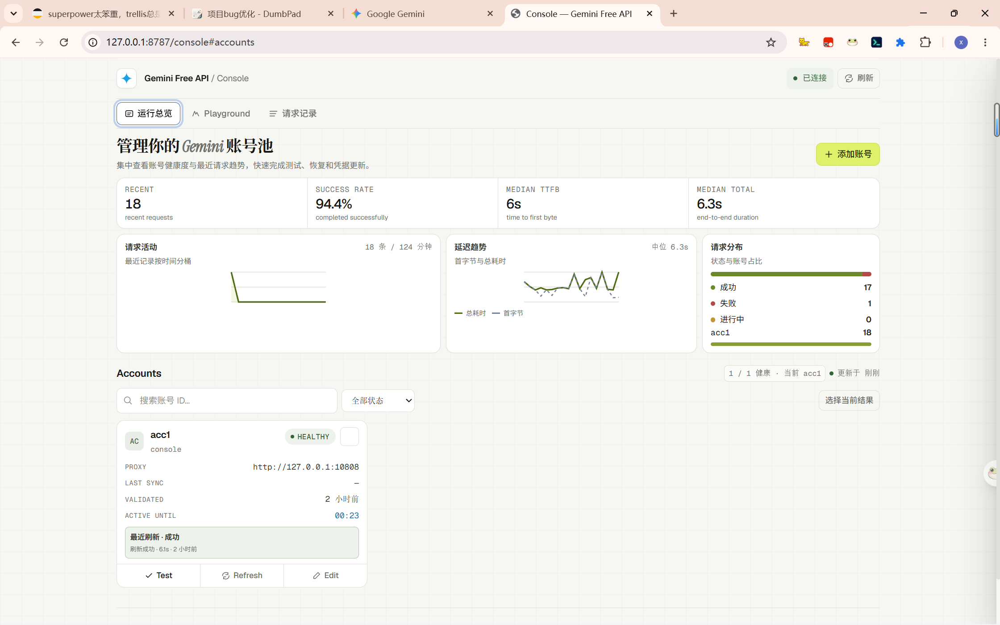

# Gemini Web to API 

把 Gemini 网页端封装成 OpenAI / Claude / Gemini 兼容接口的本地代理服务。

基于网页端逆向实现，依赖 Google Gemini Web 的私有请求结构。适合个人研究和本地客户端接入。

## 能力概览

| 能力 | OpenAI | Claude | Gemini 原生 |
|:---|:---:|:---:|:---:|
| 文本对话 | ✅ | ✅ | ✅ |
| 流式输出 | **实时流** | 模拟流 | 模拟流 |
| Thinking Level | ✅ | — | — |
| 多轮上下文 | 实验性 | — | — |
| 图片/文件输入 | ✅ | ✅ | ✅ |
| 工具调用 | 实验性桥接 | 桥接 | 桥接 |

## 快速开始

```bash
cp .env.example .env
# 编辑 .env，至少填写 COOKIE_SYNC_TOKEN
go run cmd/server/main.go
```

服务默认监听 `http://localhost:8787`，API 文档 `http://localhost:8787/docs`。

### 基础配置

**获取cookie**：

1. 请访问[gemini.google.com](https://gemini.google.com/)并登录
2. 按`F12` →**Application**→**Storage**→ **Cookies**
3. 复制`__Secure-1PSID`和`__Secure-1PSIDTS`的值

```env
PORT=8787
COOKIE_SYNC_TOKEN=你的管理密钥
PROXY_URL=http://127.0.0.1:10808
```

单账号模式直接填写 Cookie：

```env
GEMINI_1PSID=你的 __Secure-1PSID
GEMINI_1PSIDTS=可选，留空自动轮换
```

多账号模式：

```env
GEMINI_ACCOUNTS=main,backup1
GEMINI_ACCOUNT_MAIN_1PSID=主号 __Secure-1PSID
GEMINI_ACCOUNT_MAIN_PROXY=socks5h://127.0.0.1:10808
GEMINI_ACCOUNT_MAIN_PRIORITY=3

GEMINI_ACCOUNT_BACKUP1_1PSID=备用号 __Secure-1PSID
GEMINI_ACCOUNT_BACKUP1_PROXY=http://127.0.0.1:10809
```

> Docker 环境下代理地址用 `http://host.docker.internal:10808`，`docker-compose.yml` 已内置映射。

## Web 控制台

访问 `http://localhost:8787/console`，使用 `COOKIE_SYNC_TOKEN` 登录。



控制台功能：

- 账号列表：状态、代理、同步时间、健康度
- 添加 / 编辑 / 删除账号
- 账号测试：发送真实对话消息验证可用性
- 代理测试：验证代理连通性

### Playground

控制台内置 Playground 聊天界面，支持模型切换、Thinking Level 调节和流式对话测试。


## 调用示例

### 流式对话

```bash
curl http://localhost:8787/openai/v1/chat/completions \
  -H "Content-Type: application/json" \
  -d '{
    "model": "gemini-3.5-flash",
    "stream": true,
    "messages": [{"role": "user", "content": "你好"}]
  }'
```

### Thinking Level

```json
{
  "model": "gemini-3.5-flash",
  "reasoning_effort": "high",
  "stream": true,
  "messages": [{"role": "user", "content": "详细分析这个问题"}]
}
```

| 参数 | 值 | 对应 |
|:---|:---|:---|
| `reasoning_effort` | `low` / `medium` | Standard |
| `reasoning_effort` | `high` | Extended |
| `thinking_level` | `standard` / `extended` | 直接映射 |

### 文件上传

```bash
curl http://localhost:8787/openai/v1/files \
  -F purpose=assistants \
  -F file=@./note.txt
```

返回 `file_id` 后在 messages 中引用：

```json
{
  "role": "user",
  "content": [
    {"type": "input_text", "text": "总结这个文件"},
    {"type": "input_file", "file_id": "file-...", "filename": "note.txt"}
  ]
}
```

### Python SDK

```python
from openai import OpenAI

client = OpenAI(base_url="http://localhost:8787/openai/v1", api_key="not-needed")

stream = client.chat.completions.create(
    model="gemini-3.5-flash",
    stream=True,
    messages=[{"role": "user", "content": "你好"}],
)

for chunk in stream:
    if chunk.choices[0].delta.content:
        print(chunk.choices[0].delta.content, end="", flush=True)
```

## 模型列表

| 模型名 | 说明 |
|:---|:---|
| `gemini-3.5-flash` | UI 可见模型 |
| `gemini-3.1-flash-lite` | UI 可见模型 |
| `gemini-3.1-pro` | UI 可见模型 |

需要深度思考时使用 Thinking Level 参数，而非依赖模型名后缀。

## 性能与可靠性

### 已优化项

| 优化点 | 修复前 | 修复后 | 影响 |
|:---|:---|:---|:---|
| 流式解析 O(n²) | 每个 16KB chunk 全量重扫 512KB 缓冲区 | 8KB 增量节流，仅在足够新数据到达时重解析 | 长回复 CPU 开销降低 ~94% |
| 会话读锁竞争 | `conversationID` / `IsConversationUntrusted` 等用写锁 (`Lock`) 做纯读操作 | 改用 `RLock` / `RUnlock`，读操作不再互斥 | 高并发下吞吐量显著提升 |
| Timer GC 压力 | 流式循环每次迭代 `time.NewTimer` | 循环外创建一次，循环内 `Reset` 复用 | 减少 GC 压力和内存分配 |
| HTTP 客户端复用 | `refreshSessionToken` 每次创建新 `req.Client` 和 `http.Client` | 复用 `httpClient` 和 `rawHTTPClient`，连接池保持 | 减少 TLS 握手，降低刷新延迟 |
| 文件上传并行化 | 多文件串行上传 | goroutine 并行上传（并发度 4），保持顺序 | 多文件场景延迟降低 ~75% |
| Cookie 缓存原子写 | `os.WriteFile` 非原子，崩溃可能损坏 | 临时文件 + `os.Rename` 原子替换 | 杜绝缓存文件损坏 |
| `conversationTo` 内存泄漏 | map 无限增长 | 12h TTL 自动清理 | 长期运行内存稳定 |
| toolBridge/toolPlanner 清理 | `pruneTranscriptContextsLocked` 遗漏这三组 map | 补全 TTL 清理 | 防止上下文缓存内存泄漏 |
| `Close()` 双关 panic | 多次调用 `close(stopRefresh)` panic | `sync.Once` 保护 | 杜绝 panic |
| `generateChatID` 碰撞 | `math/rand` 可能碰撞 | `crypto/rand` 24 字符 hex | 彻底消除碰撞 |

### Benchmark 结果

```
BenchmarkExtractStreamTextFromBuffer-12    256KB buffer    ~4.5ms/op   36-40 MB/s
BenchmarkHasConversationStateRLock-12      1000 entries    20.87 ns/op  0 allocs
BenchmarkPruneConversationsLocked-12       1000 entries    220μs/op
BenchmarkGenerateChatID-12                 crypto/rand     240 ns/op    88 B/op
```

## Docker 部署

### 快速启动

```bash
# 1. 复制环境配置
cp .env.example .env
# 编辑 .env 填写 COOKIE_SYNC_TOKEN 和 Cookie

# 2. 启动服务
docker compose up -d --build

# 3. 查看日志
docker compose logs -f
```

服务启动后访问：
- API 端点：`http://localhost:8787/openai/v1/chat/completions`
- Web 控制台：`http://localhost:8787/console`
- API 文档：`http://localhost:8787/docs`

### 配置说明

#### 单账号模式

```env
COOKIE_SYNC_TOKEN=your_secure_token
GEMINI_1PSID=your__Secure_1PSID_cookie
GEMINI_1PSIDTS=your__Secure_1PSIDTS_cookie  # 可选
```

#### 多账号模式（推荐）

```env
COOKIE_SYNC_TOKEN=your_secure_token
GEMINI_ACCOUNTS=acc1,acc2,acc3

GEMINI_ACCOUNT_ACC1_1PSID=xxx
GEMINI_ACCOUNT_ACC1_PRIORITY=3
GEMINI_ACCOUNT_ACC1_PROXY=http://host.docker.internal:10808

GEMINI_ACCOUNT_ACC2_1PSID=xxx
GEMINI_ACCOUNT_ACC2_PRIORITY=2
```

### 网络配置

| 场景 | 代理地址写法 |
|:---|:---|
| 宿主机代理 (Windows/Mac) | `http://host.docker.internal:10808` |
| 宿主机代理 (Linux) | `http://172.17.0.1:10808` |
| 容器内 Clash | `http://clash:7890` |
| 无代理 | 留空 |

### 数据持久化

| 挂载路径 | 说明 | 建议 |
|:---|:---|:---|
| `./data` | Cookie 缓存、账号状态、请求日志 | 必须持久化 |
| `./.env` | 配置文件（只读挂载） | 修改后 `docker compose restart` 生效 |
| `./.cookies` | Cookie jar 文件 | 可选 |

### 构建特性

- **多阶段构建**：分离编译和运行环境，镜像体积更小
- **BuildKit 缓存**：Go 模块缓存挂载，重复构建更快
- **国内加速**：默认使用 `GOPROXY=goproxy.cn`
- **静态资源嵌入**：`console.html` 通过 `go:embed` 编入二进制

## Admin API

所有 `/admin/*` 请求需带 `Authorization: Bearer <COOKIE_SYNC_TOKEN>`。

```bash
# 列出账号
curl http://localhost:8787/admin/accounts -H "Authorization: Bearer $TOKEN"

# 添加账号
curl -X POST http://localhost:8787/admin/accounts \
  -H "Content-Type: application/json" \
  -H "Authorization: Bearer $TOKEN" \
  -d '{"account_id":"acc3","secure_1psid":"...","proxy_url":"..."}'

# 测试账号
curl -X POST http://localhost:8787/admin/accounts/acc1/test -H "Authorization: Bearer $TOKEN"

# 测试代理
curl -X POST http://localhost:8787/admin/proxy-test \
  -H "Content-Type: application/json" \
  -H "Authorization: Bearer $TOKEN" \
  -d '{"proxy_url":"http://host.docker.internal:10808"}'
```

## 开发

```bash
go test ./...
```

维护者文档：

- [技术细节](docs/technical-details.md) — 多轮上下文、工具桥接、Cookie 快速同步与 Worker、容错策略、排错开关、环境变量完整列表
- [Core Bridge Handoff](docs/core-bridge-handoff.md) — 核心边界和改动入口
- [Stream Pipeline](docs/openai-gemini-stream-pipeline.md) — 完整流程说明

## 说明

本项目基于[ntthanh2603/gemini-web-to-api](https://github.com/ntthanh2603/gemini-web-to-api) ，后重塑了主要功能，优化了整个请求链路，保留了部分特性。Gemini 网页端结构可能变化，涉及 `f.req`、`x-goog-ext-*`、`c/r/rc/context token` 的行为以抓包和回归测试为准。
